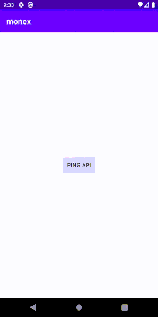

# Monex

Monex is an in-app HTTP inspector for Android OkHttp clients, which is a fork of [Chuck](https://github.com/jgilfelt/chuck) made for using internally within nexlabs. 

The bionomial name of Groundhog, also known as Wood*chuck*, is called
Marmota Monax. Monax is taken from this name, and repurposed to *nex* as
in *nexlabs*. Thus, the name **Monex**



## How it works

Monex displays a low-priority notification every time a network request
is made through your `OkHttpClient`. Tapping on the notification will
display a list of network requests you have made for your app. You can
then tap on any item to see full details and share those easily.

## Getting Started

### Add Dependency

TODO()

### Setup

Inside your app where you build your `OkHttpClient`, you can add `MonexInterceptor`

```kotlin
val okHttpClient = OkHttpClient.Builder()
.addNetworkInterceptor(MonexInterceptor(context))
.build()
```

Then just hit run and it will start logging each request you made.

## Configuration

### Hide Notification

You can also pass `showNotification` boolean variable inside
`MonexInterceptor` constructor. Set this to `false` if you don't want to
see any notifications. You can still manually launch the history
activity through `Monex.getLaunchIntent(context))` which return the
Launcher activity of Monex.

### Gitlab setup

Monex can uses Gitlab's
[snippet API](https://docs.gitlab.com/ee/api/snippets.html) to
automatically generate snippet link for sharing a transaction detail. By
default, this is disabled. To enable sharing as Gitlab snippet, you will
have to provide a `MonexGitlabConfig` in the constructor. The
constructor has two parameters; `accessToken`, and `baseUrl`

To add an access token,

- Go to `{YOUR_GITLAB_LINK}/profile/personal_access_tokens` 
- Copy the token
- Provide it inside `MonexGitlabConfig`constructor
- Pass the config into constructor of `MonexInterceptor`

```kotlin
val gitlabConfig = MonexGitlabConfig(
    accessToken = "{YOUR_ACCESS_TOKEN}",
    baseUrl = "{YOUR_GITLAB_LINK}" //By default, uses "https://gitlab.com/"
)
```

**WARNING: Make sure your personal access token was not leaked when
providing source code to someone. If you feel like it might has been
leaked, disable the token immediately**

## Contribution

The tool is in very early stage and we need your help to grow this further. You can help the growth by 

- Providing PR for existing isses
- Suggesting new issues, and feature requests
- Commenting your thoughts on existing issues
- Using the library yourself

